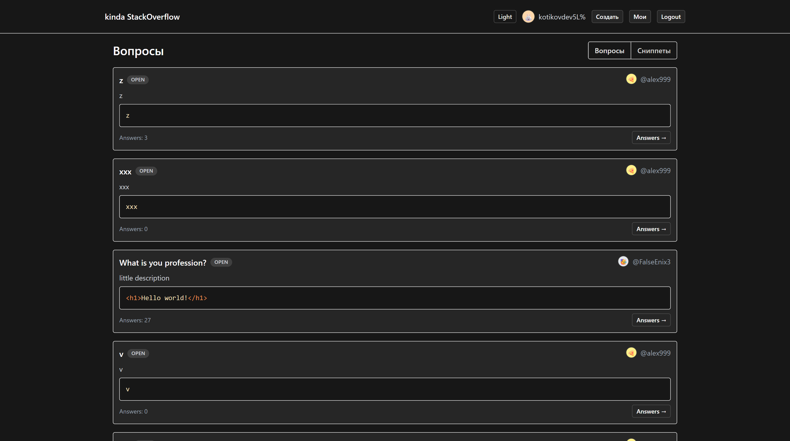
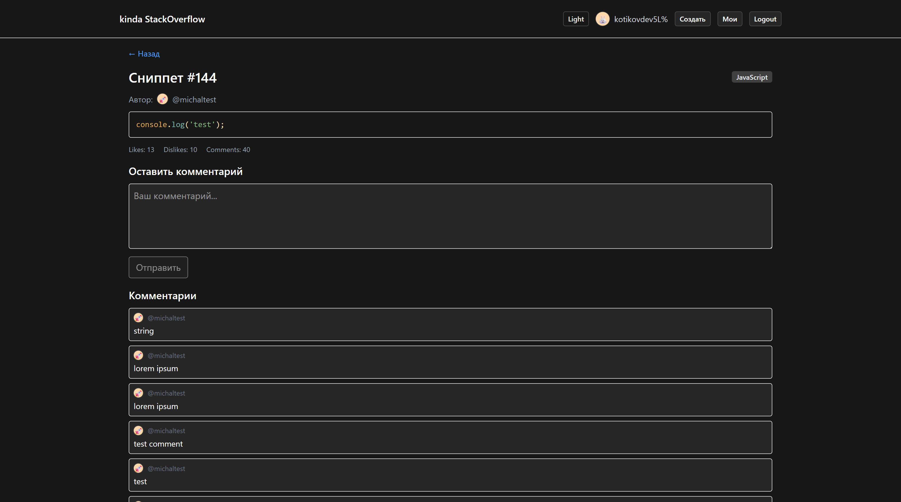
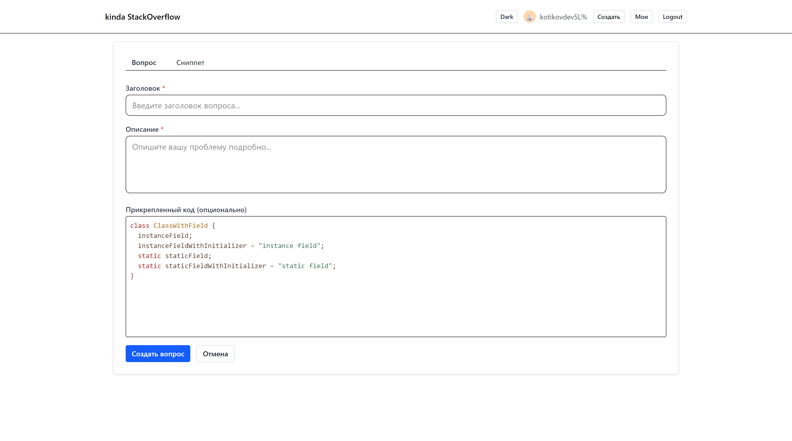

# StackOverflow Clone (Frontend + WebSocket Relay)

[Русский](./README.md) | English

Modern educational single page application (StackOverflow‑like domain):
questions with answers, code snippets with likes/dislikes and comments, user account management, real‑time updates via Socket.IO.

> NOTE: For real‑time features you MUST run the separate WebSocket relay server located in `websocket-server` (see "Running the WebSocket server"). Without it the UI works, but no live events (comments / answers / status changes) will arrive.

## Backend / API

Production REST API base URL: <https://codelang.vercel.app>

API documentation (Swagger / OpenAPI): <https://codelang.vercel.app/docs>

Locally the frontend uses a Vite proxy mapping `/api` → `https://codelang.vercel.app` (see `vite.config.ts`). Override `VITE_API_BASE_URL` if you need a different backend.

## Features

- Authentication (login / logout / register) with session persistence (cookies, `withCredentials`).
- Questions: create, edit, delete, answers, mark/unmark answer correctness, live updates of answers and their states.
  
- Snippets: create, edit, delete, like / dislike, comments, live comment updates.
  
- Infinite pagination (`useInfiniteQuery`).
- Optimistic updates + subsequent cache validation (React Query invalidation).
- Toast‑like notifications via a lightweight window event emitter.
- Theming (light / dark) with user preference persistence and system preference fallback.
  
- Code editor / viewer (CodeMirror + Prism highlight).
  
- Type‑safe forms (`react-hook-form` + `zod`).
- Path alias imports (`@`, `@/shared`, etc.) configured in Vite.

## Tech Stack

Frontend:

- React 19 + TypeScript
- Vite 7 (fast build, HMR, mkcert for local https)
- React Router v7
- TanStack React Query (data / cache / synchronization)
- Socket.IO client (real‑time)
- Tailwind CSS 4
- Axios (HTTP)
- React Hook Form + Zod (validation)
- CodeMirror / Prism (editor & syntax highlighting)

WebSocket relay server (`/websocket-server`):

- Node.js + TypeScript
- socket.io (server)
- Simple event relay (comments & answers) without direct REST API access.

## Architectural Overview

Feature / slice inspired layout:

- `src/app` — context providers (auth, theme, notifications), top‑level layout pieces.
- `src/entities` — domain entities (question, snippet, user): types, API hooks, business hooks.
- `src/pages` — route pages & view compositions.
- `src/shared` — shared utilities: HTTP client, normalization, socket, notifications, UI components, forms, language service.
- `websocket-server` — standalone Socket.IO relay.

Data fetching & mutations are encapsulated in hooks (`useQuestion`, `useCreateAnswer`, `useSnippets`, etc.). Real‑time subscriptions are separate hooks (`useSnippetComments`, `useQuestionAnswers`). Socket events update the React Query cache (`setQueryData`) and then optionally trigger `invalidateQueries` to reconcile with backend truth.

## Real‑time Events

Comment (snippet room `snippet:{id}`):

- `comment:created`, `comment:updated`, `comment:deleted`.

Answer (question room `question:{id}`):

- `answer:created`, `answer:state_changed`, `answer:updated`, `answer:deleted`.

Client first persists via REST, then (for responsiveness) may emit an event (optimistic relay) which is later confirmed by cache invalidation.

## Environment Variables (Vite)

Use `.env.local` (do not commit) if you need overrides:

```bash
VITE_API_BASE_URL=/api                 # Default /api (proxied via vite.config)
VITE_SOCKET_URL=http://localhost:4000  # WebSocket relay URL (dev)
VITE_SOCKET_PATH=/socket.io            # Optional, auto‑derived when omitted
```

If the API backend is separate (no Vite proxy), set full origin:

```bash
VITE_API_BASE_URL=https://api.example.com
```

## Quick Start (Frontend)

1. Install dependencies:

   ```powershell
   npm install
   ```

1. (Optional) create `.env.local` to override API / Socket.

1. Run dev server:

   ```powershell
   npm run dev
   ```

1. Open <https://localhost:5173>. (mkcert produces a local cert; add a browser exception if warned.)

## Running the WebSocket Server

Enter the subfolder and install separately:

```powershell
cd .\websocket-server
npm install
npm run dev   # starts on port 4000
```

You should see: `Socket.io server started on ws://localhost:4000`.

Ensure the frontend can reach it (default `VITE_SOCKET_URL=http://localhost:4000`).

## Build & Preview

```powershell
npm run build   # tsc -b + vite build
npm run preview # local static preview
```

Production bundle is emitted to `dist`.

## Scripts

- `npm run dev` — Vite dev server (https + HMR)
- `npm run build` — type check (project refs) + build
- `npm run preview` — preview built SPA
- `npm run lint` — ESLint

## HTTP Client & Auth

`src/shared/api/http.ts` configures Axios with `baseURL = VITE_API_BASE_URL || /api`, `withCredentials: true`. A 401 interceptor redirects to `/login?from=...` for protected pages.

## Caching Strategy

React Query:

- Lists (`useInfiniteQuery`) key pattern: `['questions', { search, sortBy }]`.
- Details: `['question', id]`, `['snippet', id]`.
- Post-mutation targeted invalidation.
- Real‑time events first patch cache (`setQueryData`), then optionally reconcile using `invalidateQueries`.

## Theming

`ThemeProvider` sets `data-theme` and toggles `dark` class on `html` & `body`, persisting selection in `localStorage` (values: `light | dark`).

## Notifications

`src/shared/notifications.ts` provides a tiny CustomEvent bus. Hooks dispatch success / error messages (auto TTL).

## Adding a New Entity (Pattern)

1. Create `src/entities/<entity>`: `types.ts`, `api.ts`, `hooks/`.
2. Define types + normalization adapter.
3. Implement hooks: list (`use<Entity>s`), detail (`use<Entity>`), mutations via `useApiMutation`.
4. Add socket subscription hook if needed (model after `useSnippetComments` / `useQuestionAnswers`).

## Real‑time Integration Details

File `src/shared/socket.ts`:

- Lazy client initialization.
- Env driven config (`VITE_SOCKET_URL`, `VITE_SOCKET_PATH`).
- Forced WebSocket transport.
- Verbose dev logging of connect / errors.

## Codebase Style

- Type‑first: domain types in `entities/*/types.ts`.
- Manual lightweight normalization (coercion, counts for likes/dislikes, etc.).
- Avoid unnecessary rerenders: structured query keys, limited retries, disabled `refetchOnWindowFocus` for list views.

## Quality Gate

Before committing:

```powershell
npm run lint
npm run build
```

---

See Russian version in `README.md` for original description or open an issue for questions.
