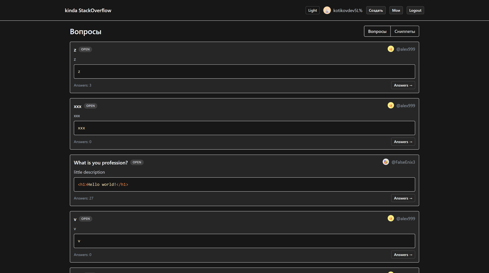
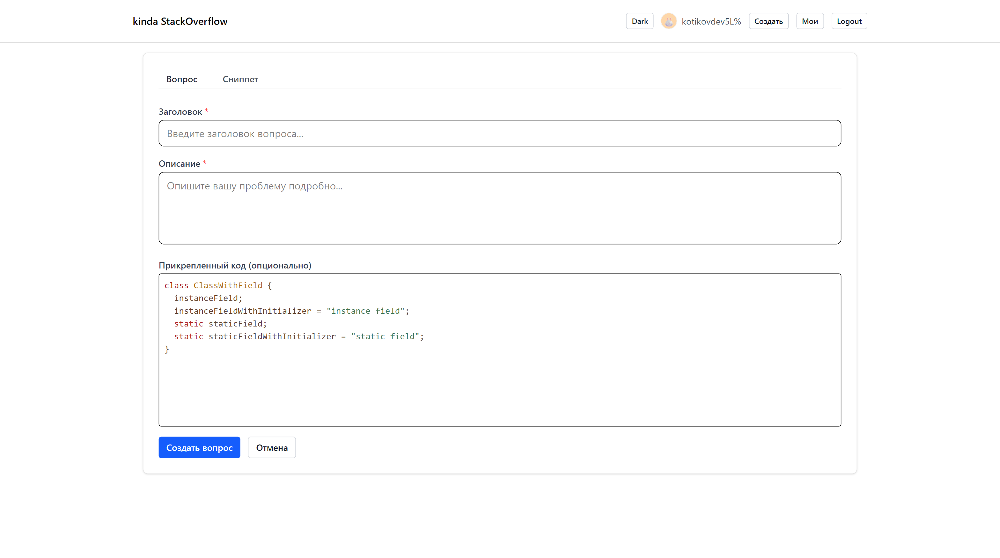

# StackOverflow Clone (Frontend + WebSocket Relay)

Русский | [English](./README.en.md)

Современное учебное SPA-приложение (аналог StackOverflow по набору сущностей):
вопросы с ответами, сниппеты кода с лайками/дизлайками и комментариями, учётная запись пользователя, real‑time обновления через Socket.IO.

## Основные возможности

- Аутентификация (login / logout / register) с сохранением сессии (cookies, `withCredentials`).
- Вопросы: создание, редактирование, удаление, ответы, пометка ответов как корректных, live‑обновление ответов и их статусов.
  
- Сниппеты: создание, редактирование, удаление, лайк / дизлайк, комментарии, live‑обновление комментариев.
  
- Пагинация и бесконечная прокрутка (`useInfiniteQuery`).
- Оптимистические обновления + последующая валидация через инвалидацию кэша React Query.
- Уведомления (toast-like) через простой EventEmitter на window.
- Темизация (light / dark) с сохранением предпочтений и уважением системной темы.
  
- Code editor / viewer (CodeMirror + Prism highlight).
  
- Type‑safe формы (`react-hook-form` + `zod`).
- Alias импорты (`@`, `@/shared`, и т.д.) настроены в Vite.

## Технологический стек

Frontend:

- React 19 + TypeScript
- Vite 7 (быстрая сборка, HMR, mkcert для https локально)
- React Router v7
- TanStack React Query (данные / кэш / синхронизация)
- Socket.IO client (real‑time)
- Tailwind CSS 4
- Axios (HTTP)
- React Hook Form + Zod (валидация)
- CodeMirror / Prism (редактор и подсветка кода)

WebSocket relay сервер (`/websocket-server`):

- Node.js + TypeScript
- socket.io (сервер)
- Простая ретрансляция событий (комментарии и ответы) без прямого доступа к REST API.

## Важное примечание

Для работы live‑обновлений необходимо запустить отдельный WebSocket сервер из папки `websocket-server` (см. раздел Запуск). Без него интерфейс будет работать, но real‑time события (комментарии, ответы, изменения статусов) не будут приходить.

## Бэкенд / API

Продакшен REST API развёрнут по адресу: <https://codelang.vercel.app>

Документация (Swagger / OpenAPI): <https://codelang.vercel.app/docs>

Локально фронтенд по умолчанию использует Vite proxy для пути `/api` → `https://codelang.vercel.app` (см. `vite.config.ts`). Если требуется направить запросы на иной бекэнд, переопределите `VITE_API_BASE_URL`.

## Архитектурный обзор

Структура организована в стиле feature / slices:

- `src/app` — провайдеры контекстов (auth, theme, notifications), верхнеуровневые layout компоненты.
- `src/entities` — доменные сущности (question, snippet, user): типы, API hooks, бизнес-хуки.
- `src/pages` — страницы роутера (маршруты и их представления).
- `src/shared` — общие утилиты: HTTP клиент, нормализация API, сокет, уведомления, UI компоненты, формы, сервис языка.
- `websocket-server` — независимый Socket.IO relay.

Логика получения и мутации данных инкапсулирована в hooks (`useQuestion`, `useCreateAnswer`, `useSnippets`, и т.д.). Real‑time подписки оформлены отдельными hooks (`useSnippetComments`, `useQuestionAnswers`). Сокет событийно синхронизирует клиентский кэш (через `queryClient.setQueryData` + `invalidateQueries`).

## Реалтайм события

Комментарий (snippet room `snippet:{id}`):

- `comment:created`, `comment:updated`, `comment:deleted`.

Ответ (question room `question:{id}`):

- `answer:created`, `answer:state_changed`, `answer:updated`, `answer:deleted`.

Клиент сначала сохраняет сущность через HTTP (REST), затем (для отзывчивости) часть событий может отправляться клиентом самим (optimistic relay) и подтверждаться через инвалидацию кэша.

## Переменные окружения (Vite)

Используйте файл `.env.local` (не коммитить) при необходимости:

```bash
VITE_API_BASE_URL=/api                 # По умолчанию /api (proxy на внешний бекенд через vite.config)
VITE_SOCKET_URL=http://localhost:4000  # URL websocket-сервера (dev)
VITE_SOCKET_PATH=/socket.io            # Не обязательно, вычисляется автоматически
```

Если API размещён отдельно (не через proxy), установите полный origin, напр.:

```bash
VITE_API_BASE_URL=https://api.example.com
```

## Быстрый старт (Frontend)

1. Установить зависимости:

```powershell
npm install
```

1. (Опционально) создать `.env.local` для переопределения API / Socket.

1. Запустить дев‑сервер:

```powershell
npm run dev
```

1. Открыть <https://localhost:5173> (mkcert генерирует локальный сертификат). Если браузер предупреждает о самоподписанном сертификате — добавить исключение.

## Запуск WebSocket сервера

Перейдите в подпапку и установите его зависимости отдельно:

```powershell
cd .\websocket-server
npm install
npm run dev   # запустит на порту 4000
```

Сообщение в консоли: `Socket.io server started on ws://localhost:4000`.

Убедитесь, что фронтенд видит его (по умолчанию `VITE_SOCKET_URL=http://localhost:4000`).

## Сборка и предпросмотр

```powershell
npm run build   # tsc -b + vite build
npm run preview # локальный статический preview
```

Готовый production билд будет в папке `dist`.

## Скрипты

- `npm run dev` — старт дев-сервера Vite (https + HMR)
- `npm run build` — типизация (project refs) + сборка
- `npm run preview` — предпросмотр собранного SPA
- `npm run lint` — ESLint проверка

## HTTP клиент и авторизация

`src/shared/api/http.ts` создаёт экземпляр Axios с `baseURL = VITE_API_BASE_URL || /api` и `withCredentials: true`. Интерцептор 401 делает редирект на `/login?from=...` если страница частная.

## Работа с кэшем

React Query:

- Списки (`useInfiniteQuery`) с ключами вида `['questions', { search, sortBy }]`.
- Детали: `['question', id]`, `['snippet', id]`.
- После мутаций — точечная инвалидация.
- Live‑события сначала обновляют кэш локально (`setQueryData`), затем вызывают `invalidateQueries` для сверки с сервером.

## Темизация

`ThemeProvider` добавляет атрибуты `data-theme` и класс `dark` на `html` и `body`, сохраняет выбор в `localStorage`. Возможные значения: `light | dark`.

## Уведомления

Файл `src/shared/notifications.ts` — простая шина событий (CustomEvent) с типами. Используется хуками мутаций для показа успеха / ошибок.

## Добавление новой сущности (рекомендованный паттерн)

1. Создать директорию в `src/entities/<entity>`: `types.ts`, `api.ts`, `hooks/`.
2. Определить типы и адаптер нормализации.
3. Hooks `use<Entity>s`, `use<Entity>` (деталь), мутации через `useApiMutation`.
4. Подписки на сокет (если нужны) аналогично `useSnippetComments` или `useQuestionAnswers`.

## Реалтайм интеграция (деталь)

Файл `src/shared/socket.ts`:

- Автоленивая инициализация клиента.
- Конфиг через env (`VITE_SOCKET_URL`, `VITE_SOCKET_PATH`).
- Принудительный транспорт WebSocket.
- Dev‑логи подключений и ошибок.

## Стиль кодовой базы

- Type-first: типы домена в `entities/*/types.ts`.
- Минимальная «ручная» нормализация ответов (приведение чисел и строк, сбор статистик likes/dislikes).
- Избежание лишних перерендеров: составные ключи, ограниченный retry, отключение `refetchOnWindowFocus` на списках.

## Проверка качества

Перед коммитом рекомендуется:

```powershell
npm run lint
npm run build
```

---

При возникновении вопросов смотрите исходный код в соответствующих директориях или добавляйте issue.
